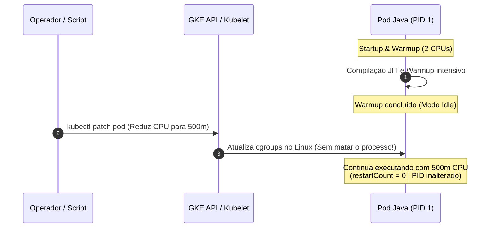

# Demo: In-Place Pod Resize no Google Kubernetes Engine (GKE)

Esta demonstração apresenta na prática o recurso de **In-Place Resource Resize for Kubernetes Pods** (redimensionamento de recursos de Pods sem reinicialização).

---

## 🎯 O Que É e Qual Problema Resolve?

### O Modelo Tradicional do Kubernetes
Historicamente no Kubernetes, os campos `resources.requests` e `resources.limits` de um Pod eram imutáveis. Para alterar a CPU ou Memória de uma carga de trabalho, era necessário:
1. Deletar e recriar o Pod (ou disparar um Rolling Update).
2. O container sofria parada forçada, incorrendo em **cold-start, perda de cache em memória e risco temporário de disponibilidade**.

### A Solução: In-Place Pod Resize
Com o recurso de In-Place Pod Resize, é possível alterar as cotas de CPU e Memória de um container em execução simplesmente aplicando um `patch` no Pod. O Kubelet atualiza os limites de **cgroups** no kernel Linux do Node em tempo de execução, **sem reiniciar o processo (PID) ou o container**.

---

## ☕ O Cenário da Demonstração: Java Startup CPU Boost

Aplicações Java (Spring Boot, Quarkus, Micronaut, etc.) são notórias por demandarem **alta CPU durante o startup**:
- Carregamento de classes e reflexão
- Compilação Just-In-Time (JIT) e otimizações C1/C2
- Inicialização de pools de conexão e frameworks

Assim que a aplicação atinge prontidão (warmup concluído), a necessidade de CPU cai drasticamente para regime estável.



---

## 📂 Estrutura da Demo

```
demos/in_place_pod_resize/
├── README.md               # Este guia detalhado
├── app/                    # Aplicação Java de teste
│   ├── src/                # Código fonte (HttpServer nativo, warmup e métricas)
│   └── Dockerfile          # Multi-stage build leve (Temurin 21)
├── k8s/                    # Manifests Kubernetes
│   ├── pod.yaml            # Pod configurado com resizePolicy
│   └── service.yaml        # Service ClusterIP
└── scripts/                # Scripts de automação
    ├── 01-build-and-push.sh # Build da imagem via Cloud Build
    ├── 02-deploy.sh         # Deploy com cota inicial de 2 CPUs
    ├── 03-watch-status.sh   # Painel de monitoramento interativo
    ├── 04-resize-cpu.sh     # Executa o patch in-place para 500m
    └── 05-cleanup.sh        # Remove os recursos da demo
```

---

## ⚙️ A Política de Redimensionamento (`resizePolicy`)

No arquivo [`k8s/pod.yaml`](file:///Users/gustavolapa/dev/github/gke-feature-demos/demos/in_place_pod_resize/k8s/pod.yaml), declaramos o bloco `resizePolicy`:

```yaml
spec:
  containers:
  - name: java-app
    image: <IMAGE_URI>
    resources:
      requests:
        cpu: "2"
        memory: "512Mi"
      limits:
        cpu: "2"
        memory: "512Mi"
    resizePolicy:
    - resourceName: cpu
      restartPolicy: NotRequired       # CPU é redimensionada sem reiniciar o container
    - resourceName: memory
      restartPolicy: RestartContainer  # Para memória, se necessário pode exigir restart
```

Valores válidos para `restartPolicy`:
- `NotRequired`: O Kubelet redimensiona o recurso ajustando os cgroups sem parar o container.
- `RestartContainer`: O Kubelet reinicia o container para aplicar o novo limite.

---

## 🚀 Passo a Passo para Apresentação da Demo

### Pré-requisitos
1. Cluster GKE criado (veja instruções em [`infra/`](file:///Users/gustavolapa/dev/github/gke-feature-demos/infra/README.md)).
2. Arquivo `.env` configurado com `PROJECT_ID`, `REGION`, etc.

---

### Passo 1: Compilar e Publicar a Imagem

Execute o script de build via Google Cloud Build:
```bash
./demos/in_place_pod_resize/scripts/01-build-and-push.sh
```
> O Cloud Build compilará o código Java e publicará a imagem no seu Google Artifact Registry sem precisar de Docker local.

---

### Passo 2: Fazer o Deploy Inicial (2 CPUs)

Execute o deploy:
```bash
./demos/in_place_pod_resize/scripts/02-deploy.sh
```

Saída esperada:
```text
Deploy do Pod Java com Alta CPU Inicial (Startup)
CPU Inicial Solicitada: 2 CPUs (requests/limits: 2)
Aguardando o Pod estar em estado 'Ready'...
✔ Pod iniciado com sucesso!
```

---

### Passo 3: Abrir o Painel de Monitoramento (Terminal 1)

Em uma janela de terminal, inicie o monitor em tempo real:
```bash
./demos/in_place_pod_resize/scripts/03-watch-status.sh
```

Você verá o painel interativo exibindo:
```text
========================================================================
        PAINEL DE STATUS - IN-PLACE POD RESIZE DEMO (GKE)              
========================================================================
Pod:           java-startup-resize-demo (Fase: Running)
Node:          gk3-gke-demos-cluster-pool-1-abc1234
Restart Count: 0 (ZERO RESTARTS - Processo contínuo!)
------------------------------------------------------------------------
RECURSOS CONFIGURADOS (Spec vs Status):
  • Spec Desejado (requests / limits): 2 / 2
  • Status Alocado no Node (Kubelet):  2
  • Status do Resize:                  Completed / Steady
------------------------------------------------------------------------
ÚLTIMOS LOGS DO POD (Heartbeat & Warmup):
[WARMUP COMPLETE] Startup phase finished.
[WARMUP COMPLETE] Application in steady state idle.
[WARMUP COMPLETE] Ready for In-Place CPU reduction without restart!
[HEARTBEAT] PID: 1 | Uptime: 20s | Cores (JVM): 2 | Heap: 48MB/384MB | Warmup: DONE
========================================================================
```

---

### Passo 4: Executar o In-Place Resize (Terminal 2)

Em **outra janela de terminal**, execute a redução dinâmica de CPU:
```bash
./demos/in_place_pod_resize/scripts/04-resize-cpu.sh
```

*(Opcional: Você pode passar um valor customizado, ex: `./demos/in_place_pod_resize/scripts/04-resize-cpu.sh 250m`)*

Saída exibida:
```text
========================================================================
 Executando In-Place Pod Resize (Redução de CPU sem reiniciar o Pod)
========================================================================
Pod Alvo:            java-startup-resize-demo
Container:           java-app
Nova CPU Solicitada: 500m (requests e limits)
------------------------------------------------------------------------
Aplicando patch no Pod para redimensionar recursos in-place...
pod/java-startup-resize-demo patched

✔ Patch aplicado com sucesso!
Estado APÓS o Resize:
  • Novo Spec CPU:   500m
  • Restart Count:   0 (Container PERMANECEU vivo sem reiniciar!)
```

---

## 🔍 O Que Mostrar Para Demonstrar Que Funcionou?

Ao apresentar esta demonstração para um cliente ou time de engenharia, destaque os seguintes pontos:

1. **`restartCount: 0`**:
   Verifique no `kubectl get pod java-startup-resize-demo` que a coluna `RESTARTS` permanece `0`.
2. **Process ID (PID) e Uptime ininterruptos**:
   Conecte-se ao Pod e consulte o endpoint de status da aplicação Java:
   ```bash
   kubectl exec -it java-startup-resize-demo -- wget -qO- http://localhost:8080/status
   ```
   *Note que o `uptime_seconds` continuou crescendo continuamente e o `pid` não mudou!*
3. **Eventos do Kubernetes**:
   Execute `kubectl describe pod java-startup-resize-demo` e observe as mensagens de resize do Kubelet:
   - Evento indicando que o Pod teve seus recursos redimensionados com sucesso no nó.
4. **Alocação de cgroups no Node**:
   O Kubelet atualizou o arquivo `cpu.max` (ou `cpu.cfs_quota_us`) diretamente no cgroup do contêiner.

---

## 🧹 Limpeza

Ao finalizar a apresentação, remova os recursos da demo:
```bash
./demos/in_place_pod_resize/scripts/05-cleanup.sh
```
