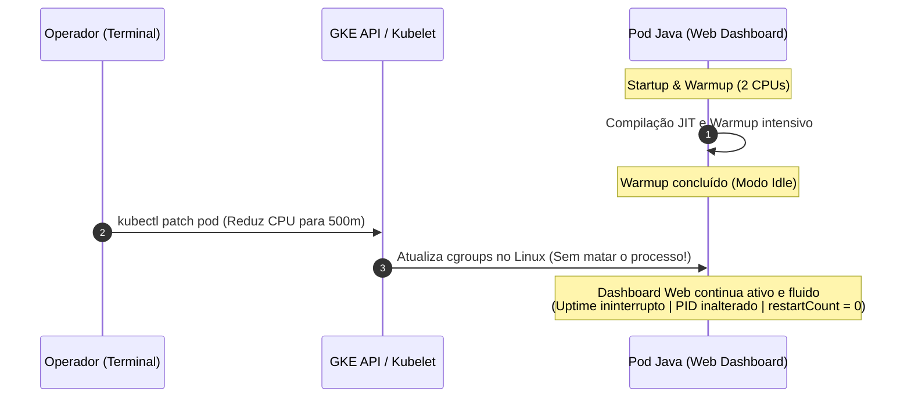

# Demo: In-Place Pod Resize no Google Kubernetes Engine (GKE)

Esta demonstração apresenta na prática o recurso de **In-Place Resource Resize for Kubernetes Pods** (redimensionamento de recursos de Pods sem reinicialização) no Google Kubernetes Engine.

---

## 🎯 O Que É e Qual Problema Resolve?

### O Modelo Tradicional do Kubernetes
Historicamente no Kubernetes, os campos `resources.requests` e `resources.limits` de um Pod eram imutáveis. Para alterar a CPU ou Memória de uma carga de trabalho, era necessário:
1. Deletar e recriar o Pod (ou disparar um Rolling Update).
2. O container sofria parada forçada, incorrendo em **cold-start, perda de cache em memória e risco temporário de disponibilidade**.

### A Solução: In-Place Pod Resize
Com o recurso de In-Place Pod Resize, é possível alterar as cotas de CPU e Memória de um container em execução simplesmente aplicando um `patch` no Pod. O Kubelet atualiza os limites de **cgroups** no kernel Linux do Node em tempo de execução, **sem reiniciar o processo (PID) ou o container**.

---

## ☕ O Cenário da Demonstração: Java Startup CPU Boost

Aplicações Java (Spring Boot, Quarkus, Micronaut, etc.) demandam **alta CPU durante o startup**:
- Carregamento de classes e reflexão
- Compilação Just-In-Time (JIT) e otimizações C1/C2
- Inicialização de pools de conexão e frameworks

Assim que a aplicação atinge prontidão (warmup concluído), a necessidade de CPU cai drasticamente para regime estável.



---

## 🖥️ Layout Recomendado para Apresentação (2 Telas)

Para uma apresentação impactante, divida seu monitor em duas metades:

| Lado Esquerdo: Navegador Web (Dashboard Java) | Lado Direito: Terminal (Operador) |
|---|---|
| **Dashboard Web em tempo real** mostrando Uptime contínuo, PID 1, pulso de vida verde e status de memória. | Terminal executando `./scripts/04-resize-cpu.sh` para redimensionar a CPU. |

---

## 📂 Estrutura da Demo

```
demos/in_place_pod_resize/
├── README.md               # Este guia detalhado
├── app/                    # Aplicação Java de teste
│   ├── src/                # Código fonte (HttpServer nativo com Web Dashboard integrado)
│   └── Dockerfile          # Multi-stage build leve (Temurin 21)
├── k8s/                    # Manifests Kubernetes
│   ├── pod.yaml            # Pod configurado com resizePolicy
│   └── service.yaml        # Service ClusterIP
└── scripts/                # Scripts de automação
    ├── 01-build-and-push.sh # Build da imagem via Google Cloud Build
    ├── 02-deploy.sh         # Deploy com cota inicial de 2 CPUs
    ├── 03-open-dashboard.sh # Abre o Dashboard Web no navegador (Tela 1)
    ├── 03-watch-status.sh   # Alternativa: Painel de terminal em tempo real
    ├── 04-resize-cpu.sh     # Executa o patch in-place para 500m (Tela 2)
    └── 05-cleanup.sh        # Remove os recursos da demo
```

---

## ⚙️ A Política de Redimensionamento (`resizePolicy`)

No arquivo [`k8s/pod.yaml`](file:///Users/gustavolapa/dev/github/gke-feature-demos/demos/in_place_pod_resize/k8s/pod.yaml), declaramos o bloco `resizePolicy`:

```yaml
spec:
  containers:
  - name: java-app
    image: <IMAGE_URI>
    resources:
      requests:
        cpu: "2"
        memory: "512Mi"
      limits:
        cpu: "2"
        memory: "512Mi"
    resizePolicy:
    - resourceName: cpu
      restartPolicy: NotRequired       # CPU é redimensionada sem reiniciar o container
    - resourceName: memory
      restartPolicy: NotRequired       # Memória também é redimensionada sem reiniciar o container
  restartPolicy: Always
```

---

## 🚀 Roteiro de Execução Passo a Passo

### Pré-requisitos
1. Cluster GKE Autopilot criado (veja instruções em [`infra/`](file:///Users/gustavolapa/dev/github/gke-feature-demos/infra/README.md)).
2. Arquivo `.env` configurado na raiz com `PROJECT_ID`, `REGION`, etc.

---

### Passo 1: Compilar e Publicar a Imagem
```bash
./demos/in_place_pod_resize/scripts/01-build-and-push.sh
```
> O Cloud Build compilará o código Java e publicará a imagem no seu Google Artifact Registry.

---

### Passo 2: Fazer o Deploy Inicial (2 CPUs)
```bash
./demos/in_place_pod_resize/scripts/02-deploy.sh
```

---

### Passo 3: Abrir o Dashboard Web na Tela 1
```bash
./demos/in_place_pod_resize/scripts/03-open-dashboard.sh
```
> Este comando inicia o encaminhamento de porta e abre automaticamente seu navegador em `http://localhost:8080`.

**O que apontar no Dashboard Web para a audiência:**
- 🟢 **Pulso Verde**: O processo está respondendo continuamente.
- ⏱️ **Uptime**: O relógio de tempo de atividade está correndo segundo a segundo.
- 🆔 **PID 1**: O processo inicial da JVM.
- 🔥 **Badge de Warmup**: Mostra a fase de inicialização inicial com alta CPU antes de estabilizar em repouso.

*(Opcional: Você também pode usar `./demos/in_place_pod_resize/scripts/03-watch-status.sh` caso prefira monitorar em modo texto no terminal).*

---

### Passo 4: Executar o In-Place Resize na Tela 2

Você tem duas formas de executar o redimensionamento:

#### Opção A (Automática via Script):
Em outro terminal ao lado do navegador, execute o script:
```bash
./demos/in_place_pod_resize/scripts/04-resize-cpu.sh
```

#### Opção B (Manual Passo a Passo via `kubectl`):
Se preferir copiar e colar os comandos `kubectl` manualmente durante a apresentação para explicar cada etapa técnica (inspeção de spec, patch com `--subresource=resize`, verificação de zero restarts e cgroups), siga o guia dedicado:
👉 [**Guia de Execução Manual Passo a Passo (MANUAL_RESIZE.md)**](MANUAL_RESIZE.md)

---

## 🔍 O Que Destacar Durante a Demonstração

1. **Continuidade da Aplicação Web**:
   Enquanto o comando no terminal aplica a nova cota de `500m`, olhe para o Dashboard Web:
   - A página **NÃO cai** e **NÃO recarrega**.
   - O contador de **Uptime NÃO reinicia do zero**.
   - O **PID continua sendo 1**.
2. **`restartCount = 0` no Kubernetes**:
   Execute `kubectl get pod java-startup-resize-demo` para comprovar que a coluna `RESTARTS` é rigorosamente `0`.
3. **Economia Imediata de Recursos**:
   Demonstramos como liberar **1.5 CPUs** para o cluster GKE sem causar nenhum milissegundo de downtime aos usuários.

---

## 🧹 Limpeza

Ao finalizar a apresentação, remova os recursos da demo:
```bash
./demos/in_place_pod_resize/scripts/05-cleanup.sh
```
